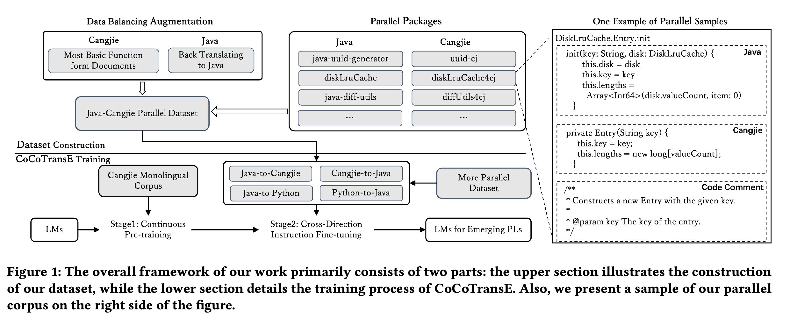

# CoCoTransE

## Overview

## Dataset Access
We have open-sourced both our Cangjie([仓颉](https://developer.huawei.com/consumer/cn/doc/cangjie-guides-V5/cj-wp-abstract-V5)) monolingual dataset and the Cangjie-Java parallel corpus. These datasets can be found in the `data` directory.

## Training
Model training is divided into two phases: continuous pretraining and instruction fine-tuning. 
- The `llm-tuning` folder contains the code for continuous pretraining and instruction fine-tuning of the StarCoder model.
- The `t5-finetuning` folder includes the code for instruction fine-tuning of the Code-T5p model.
- The `t5-pretraining` folder contains the code for continuous pretraining of the Code-T5p model.

## Evaluation
We evaluate translation results using the BLEU automated metric and Function Equivalence. The evaluation scripts are currently being organized and will be open-sourced soon. Stay tuned!