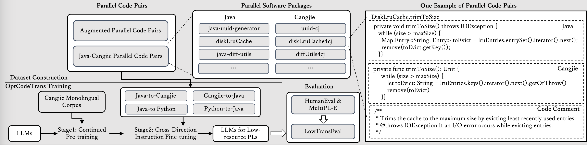

# OptCodeTrans

## Overview


## Dataset Access
We have open-sourced both our Cangjie([仓颉](https://cangjie-lang.cn/en)) monolingual dataset and the Cangjie-Java parallel corpus. These datasets can be found in the `data` directory. All processed data will be released in the near future.

## Training
Model training is divided into two phases: continuous pretraining and instruction fine-tuning. 
- The `llm-tuning` folder contains the code for continuous pretraining and instruction fine-tuning of the StarCoder model.
- The `t5-finetuning` folder includes the code for instruction fine-tuning of the Code-T5p model.
- The `t5-pretraining` folder contains the code for continuous pretraining of the Code-T5p model.

## Evaluation
We evaluate translation results using the [BLEU](https://aclanthology.org/P02-1040.pdf) automated metric and [Function Equivalence](https://openreview.net/pdf?id=fVxIEHGnVT). 

### How to run?
1. Open the `bash-test/call_bash.ipynb` file;
2. Change the model_id to the model translation result you want to evaluate. For example, you can use the demo result `starcoder2-3b_cangjie_it_2200_lr1e-05_ebs32` provided for easy testing.
3. Run the notebook for the specified model translation result;
4. In the `bash-test/call_bash.ipynb` notebook, you can see the evaluation results of the given demo result.

### Notice
1. the model translation result should be a jsonl file with the following format:
    ```jsonl
    {"src": "...", "pred": "..."}
    {"src": "...", "pred": "..."}
    {"src": "...", "pred": "..."}
    ```
2. We also privide a detailed handbook on how to execute the test-based evaluation for Cangjie in [English](https://eslroa7djx.feishu.cn/docx/LxXVdqMdyoWb9jxCSsvceHMQn1e?from=from_copylink) and [Chinese](https://m0k9pobp4ss.feishu.cn/docx/ZGuZd13Yio926axldEccDU9InKe) on using the evaluation script in the `bash-test` folder.